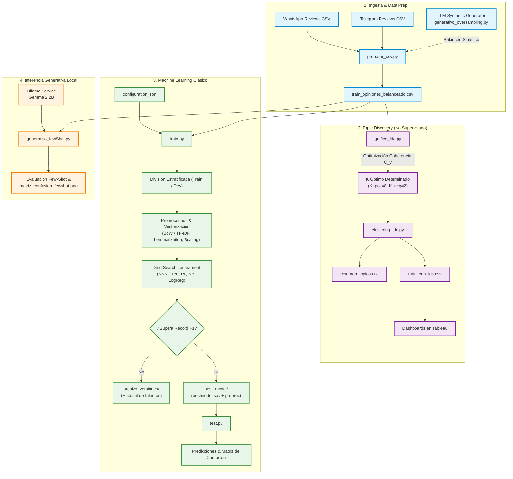

# 📱 WhatsApp vs. Telegram: Customer Intelligence & NLP Pipeline

[](https://www.python.org/)
[](https://scikit-learn.org/)
[](https://radimrehurek.com/gensim/)
[](https://www.langchain.com/)
[](https://ollama.com/)
[](https://www.tableau.com/)
[](LICENSE)

> **Pipeline integral de Procesamiento de Lenguaje Natural (NLP), Modelado de Tópicos No Supervisado y Clasificación de Sentimientos para auditar la retención, fricción y salud competitiva entre WhatsApp y Telegram.**

---

## 📋 Tabla de Contenidos
- [Visión General y Valor de Negocio](#-visión-general-y-valor-de-negocio)
- [Arquitectura del Sistema (End-to-End)](#-arquitectura-del-sistema-end-to-end)
- [Componentes del Pipeline](#-componentes-del-pipeline)
  - [1. Data Engineering y Aumento Generativo](#1-data-engineering-y-aumento-generativo)
  - [2. Topic Modeling No Supervisado (LDA & Coherencia $C_v$)](#2-topic-modeling-no-supervisado-lda--coherencia-c_v)
  - [3. Motor de Machine Learning Automatizado (Grid Search & Model Registry)](#3-motor-de-machine-learning-automatizado-grid-search--model-registry)
  - [4. Clasificación con LLM Local (Few-Shot Prompting)](#4-clasificación-con-llm-local-few-shot-prompting)
  - [5. Business Intelligence & Analítica Estratégica](#5-business-intelligence--analítica-estratégica)
- [Estructura del Proyecto](#-estructura-del-proyecto)
- [Configuración del Sistema (`configuration.json`)](#-configuración-del-sistema-configurationjson)
- [Guía de Instalación y Ejecución](#-guía-de-instalación-y-ejecución)
- [Benchmark de Modelos y Hallazgos](#-benchmark-de-modelos-y-hallazgos)
- [Buenas Prácticas de Ingeniería](#-buenas-prácticas-de-ingeniería)
- [Equipo y Contexto Académico](#-equipo-y-contexto-académico)
- [Licencia](#-licencia)

---

## 🎯 Visión General y Valor de Negocio

En el mercado global de mensajería instantánea, la retención de usuarios depende críticamente de la experiencia de usuario (UX), la privacidad, la estabilidad en actualizaciones y las limitaciones funcionales. 

Este proyecto implementa una solución completa de **Sistemas de Ayuda a la Decisión (SAD)** orientada a la inteligencia competitiva:
* **Más allá del sentimiento superficial**: En lugar de limitarse a clasificar opiniones como "positivas" o "negativas", el sistema descompone los motivos semánticos subyacentes mediante **Latent Dirichlet Allocation (LDA)**.
* **Aislamiento de quejas funcionales vs. alabanzas**: Segmentación semántica guiada por la métrica matemática de **Coherencia ($C_v$)** para identificar con precisión quirúrgica por qué los usuarios migran o abandonan una plataforma.
* **Benchmark Híbrido**: Comparación rigurosa de rendimiento, latencia y costes operativos entre **5 algoritmos clásicos de Machine Learning** y técnicas avanzadas de **IA Generativa local (LLM Gemma 2 con Few-Shot Prompting)**.
* **Cruce Demográfico y Temporal**: Enriquecimiento probabilístico de reseñas con Continente, Plataforma, Género y Temporalidad, generando datasets estructurados listos para paneles ejecutivos en **Tableau**.

---

## 🏗️ Arquitectura del Sistema (End-to-End)

El flujo de trabajo sigue un ciclo de vida de datos modular, reproducible y desacoplado:



---

## 🧩 Componentes del Pipeline

### 1. Data Engineering y Aumento Generativo
* **Normalización Multifuente (`preparar_csv.py`)**: Unifica datos procedentes de tiendas de aplicaciones y fuentes heterogéneas. Estandariza escalas de satisfacción (1–5 estrellas) a etiquetas normalizadas (`positivo`, `negativo`, `neutro`), sanea inconsistencias de codificación (UTF-8-SIG) y resuelve problemas de campos con delimitadores desalineados.
* **Oversampling Generativo (`generativo_oversampling.py`)**: Afronta el desbalanceo severo de clases minoritarias sin recurrir únicamente a duplicación o interpolación espacial simple (SMOTE). Emplea un LLM (Gemma 2 vía Ollama) con prompts guiados para generar reseñas sintéticas realistas de clases subrepresentadas.

### 2. Topic Modeling No Supervisado (LDA & Coherencia $C_v$)
* **Evaluación Empírica de Coherencia (`grafico_lda.py`)**: Ejecuta un barrido de hiperparámetros sobre el número de tópicos ($K \in [2, 8]$) evaluando la métrica matemática de **Coherencia $C_v$** de Gensim de forma independiente para reseñas positivas y negativas. Permite seleccionar empíricamente el valor óptimo de $K$ basándose en la maximización semántica.
* **Pipeline de Producción e Inteligencia (`clustering_lda.py`)**:
  * Limpieza lingüística avanzada: filtrado de idioma (`langdetect`), eliminación de stopwords de dominio (palabras vacías funcionales y nombres de marcas) y lematización morfológica exhaustiva (verbos, sustantivos, adjetivos, adverbios con WordNet).
  * Distribución probabilística de tópicos por reseña.
  * Tablas de contingencia y analítica cruzada de tópicos frente a:
    1. **Continente**: Segmentación geográfica (América, Europa, Asia, África, Oceanía).
    2. **Fuente/Aplicación**: Comparativa directa de fricción WhatsApp vs. Telegram.
    3. **Evolución Temporal**: Tendencias mensuales para detectar regresiones tras actualizaciones.
    4. **Género**: Distribución de temas por demografía de usuario.

### 3. Motor de Machine Learning Automatizado (Grid Search & Model Registry)
* **Entrenamiento y Selección de Modelos (`train.py`)**:
  * **Estrategia sin Data Leakage**: La imputación (`SimpleImputer`), escalado (`StandardScaler`), discretización (`KBinsDiscretizer`) y vectorización de texto (`CountVectorizer` / `TfidfVectorizer`) se ajustan (*fit*) exclusivamente sobre el fold de entrenamiento tras una partición estratificada.
  * **Torneo de Clasificadores**:
    * **K-Nearest Neighbors (KNN)**: Barrido en vecindarios $k$, métricas Minkowski (Manhattan $p=1$, Euclídea $p=2$) y pesos uniformes/inversos.
    * **Decision Trees & Random Forests**: Control de profundidad máxima (`max_depth`), muestras mínimas por hoja (`min_samples_leaf`) y ensamblado de estimadores (`n_estimators`).
    * **Naive Bayes Multivariante**: Versiones adaptadas al dominio textual (`MultinomialNB`), discretizadas (`CategoricalNB`) y continuas (`GaussianNB`).
    * **Logistic Regression**: Regularización penalizada $C$ y optimizadores (`lbfgs`, `saga`).
  * **Sistema de Registro y Versionado (Model Registry)**: Compara el F1-Score contra el campeón histórico registrado en `proyectos/{project_name}/best_model/`. Si un nuevo modelo supera el récord, archiva el anterior con marca temporal e instala al nuevo campeón junto con todos sus artefactos de preprocesamiento serializados.
* **Evaluación e Inferencia en Producción (`test.py`)**: Carga el clasificador ganador y deserializa automáticamente el pipeline de transformación para clasificar nuevos lotes de reseñas sin degradación ni desfase de vocabulario.

### 4. Clasificación con LLM Local (Few-Shot Prompting)
* **Inferencia Generativa (`generativo_fewShot.py`)**:
  * Utiliza **LangChain** y **Ollama** con el modelo cuantizado `gemma2:2b-text-q4_K_S` en local, garantizando privacidad total de los datos y coste de inferencia cero.
  * Emplea *Few-Shot In-Context Learning* con ejemplos equilibrados para forzar respuestas estrictas de clasificación.
  * Genera automáticamente matrices de confusión y reportes de métricas (Accuracy, Precision, Recall, F1) contra las etiquetas reales.

### 5. Business Intelligence & Analítica Estratégica
* Exportación de `train_con_lda.csv` y `resumen_topicos.txt`, estructurados específicamente para la ingesta y creación de dashboards dinámicos en **Tableau**, facilitando la toma de decisiones ejecutivas sobre el roadmap de producto.

---

## 📂 Estructura del Proyecto

```plaintext
SAD-WhatsApp/
├── 📄 configuration.json        # Motor centralizado de experimentación y configuración
├── 📄 preparar_csv.py           # Unificación, limpieza de datos y generación del CSV maestro
├── 📄 grafico_lda.py            # Barrido de coherencia C_v para selección óptima de K en LDA
├── 📄 clustering_lda.py         # Pipeline de Topic Modeling y cruce demográfico/temporal
├── 📄 train.py                  # Pipeline de entrenamiento, Grid Search y Model Registry
├── 📄 test.py                   # Script de inferencia y evaluación sobre nuevos datos
├── 📄 generativo_fewShot.py     # Clasificación zero-cost con LLM local (Ollama + LangChain)
├── 📄 generativo_oversampling.py# Generación de datos sintéticos con LLM para balanceo
├── 📄 requirements.txt          # Dependencias y librerías del proyecto
├── 📄 LICENSE                   # Licencia de código abierto MIT
└── 📁 proyectos/                # Directorio generado dinámicamente por train.py
    └── {project_name}/
        ├── 📁 datos/            # Copias de seguridad de datasets y particiones estratificadas
        ├── 📁 best_model/       # Modelo campeón actual y artefactos de preprocesado
        │   ├── bestmodel.sav
        │   ├── preprocessing_objects.sav
        │   ├── ultimos_resultados.csv
        │   └── 📁 predicciones_generadas/
        └── 📁 archivo_versiones/# Histórico cronológico de experimentos superados
```

---

## ⚙️ Configuración del Sistema (`configuration.json`)

El sistema implementa el paradigma de **Configuración como Código**, permitiendo modificar pipelines de experimentación sin alterar el código fuente:

```json
{
  "project_name": "Auditoria_WhatsApp_Telegram",
  "algorithm": "todos",
  "average_strategy": "macro",
  "preprocessing": {
    "test_split": 0.2,
    "target_variable": "sentiment",
    "drop_features": ["reviewID"],
    "missing_values": "none",
    "impute_strategy": "median",
    "scaling": "standard",
    "sampling": "none",
    "min_samples": 4,
    "text_processing": {
      "enabled": true,
      "columns": ["content"],
      "processing_type": "stem",
      "method": "bow",
      "language": "english",
      "ngram_range": [1, 2],
      "stopwords_domain": ["whatsapp", "telegram", "app"],
      "negation_words": ["not", "no", "never"]
    }
  },
  "hyperparameters": {
    "knn": { "k_min": 3, "k_max": 7, "p_min": 1, "p_max": 2, "weights": ["uniform", "distance"] },
    "trees": { "max_depth": [10, 20], "min_samples_leaf": [1, 2] },
    "random_forest": { "n_estimators": [100, 200], "max_depth": [10, 20] },
    "naive_bayes": { "n_bins": [5, 10], "alphas": [0.01, 0.1], "min_categories": null },
    "logistic_regression": { "C": [0.1, 1.0], "solver": ["lbfgs", "saga"] }
  }
}
```

### Parámetros Clave
| Bloque | Parámetro | Descripción | Valores Soportados |
| :--- | :--- | :--- | :--- |
| **Control** | `algorithm` | Algoritmo(s) a evaluar en el torneo | `"knn"`, `"tree"`, `"rf"`, `"nb"`, `"lr"`, `"todos"` |
| **Control** | `average_strategy` | Promedio métrico para clases multietiqueta | `"macro"`, `"weighted"`, `"micro"`, `"auto"` |
| **Preproceso** | `sampling` | Técnica de balanceo de clases en Train | `"none"`, `"undersampling"`, `"smote"`, `"adasyn"` |
| **Texto** | `processing_type` | Normalización morfológica | `"stem"` (Porter), `"lemmatize"` (WordNet POS) |
| **Texto** | `method` | Vectorización espacial | `"bow"` (CountVectorizer), `"tfidf"` (TfidfVectorizer) |
| **Texto** | `negation_words` | Preservación de términos clave de polaridad | Lista de cadenas (ej. `["not", "never"]`) |

---

## 🚀 Guía de Instalación y Ejecución

### 1. Requisitos Previos
* **Python**: Versión 3.8 o superior (recomendado 3.10 / 3.11).
* **Ollama**: Descargar e instalar desde [ollama.com](https://ollama.com/).
* **Modelo LLM local**:
  ```bash
  ollama pull gemma2:2b-text-q4_K_S
  ```

### 2. Configuración del Entorno Virtual
```bash
# Clonar el repositorio
git clone https://github.com/aimarlarriba/whatsapp-vs-telegram-nlp.git
cd whatsapp-vs-telegram-nlp

# Crear y activar entorno virtual
python -m venv .venv

# En Windows:
.venv\Scripts\activate
# En Linux/macOS:
# source .venv/bin/activate

# Instalar dependencias
pip install -r requirements.txt
```

### 3. Pipeline de Ejecución Paso a Paso

#### Paso A: Preparar y unificar el dataset maestro
```bash
python preparar_csv.py
```
*Genera `train_opiniones_balanceado.csv` con los datos limpios y etiquetados.*

#### Paso B: Descubrimiento de Tópicos No Supervisado (LDA)
```bash
# 1. Graficar y evaluar la coherencia semántica C_v para encontrar K óptimo
python grafico_lda.py

# 2. Ejecutar el clustering de producción y generar reportes para Tableau
python clustering_lda.py
```
*Genera `train_con_lda.csv` y `resumen_topicos.txt` con la distribución por continente, plataforma y género.*

#### Paso C: Entrenamiento y Torneo de Modelos de Machine Learning
```bash
python train.py train_opiniones_balanceado.csv configuration.json
```
*Realiza el barrido de hiperparámetros, guarda el modelo campeón en `proyectos/{project_name}/best_model/` y versiona los resultados.*

#### Paso D: Inferencia sobre Nuevas Opiniones
```bash
python test.py Auditoria_WhatsApp_Telegram best_model ruta_a_nuevas_opiniones.csv
```
*Aplica automáticamente todas las transformaciones ajustadas y genera predicciones con probabilidades en CSV.*

#### Paso E: Benchmark con LLM Local (Few-Shot Prompting)
```bash
python generativo_fewShot.py
```
*Evalúa el rendimiento de Gemma 2 en local y genera `matriz_confusion_fewshot.png` y `predicciones_sentiment.csv`.*

---

## 📊 Benchmark de Modelos y Hallazgos

### Hallazgos de Inteligencia Competitiva (Tableau Insights)
1. **WhatsApp (Focos de Fricción)**:
   * Alta concentración de quejas en temas de **límites de compresión multimedia** y **consumo excesivo de almacenamiento local**.
   * Sensibilidad negativa marcada durante cambios en políticas de privacidad o caídas de sincronización multidispositivo.
2. **Telegram (Ventajas Competitivas y Puntos Débiles)**:
   * Percepción altamente positiva en **envío de archivos pesados**, **gestión de canales/grupos** y **almacenamiento en la nube**.
   * Quejas focalizadas en presencia de **spam no moderado** y menor penetración en redes de contactos personales en ciertas regiones geográficas.

### Resumen Comparativo de Enfoques
| Enfoque | Modelo / Algoritmo | Ventajas | Limitaciones | Caso de Uso Óptimo |
| :--- | :--- | :--- | :--- | :--- |
| **No Supervisado** | LDA ($K=8$ pos, $K=2$ neg) | Descubre problemas desconocidos sin etiquetar; interpretable | Requiere ajuste manual de $K$ y stopwords | Auditoría cualitativa y BI en Tableau |
| **Supervisado Clásico** | Random Forest / Regresión Logística | Inferencia ultrarrápida (<5ms); bajo consumo de RAM | Depende de la calidad del vectorizador léxico | Clasificación en producción a gran escala |
| **Generativo Local** | Gemma 2 (2B) Few-Shot | Excelente comprensión de contexto, sarcasmo y jerga | Mayor latencia por muestra (~100-200ms) | Auditoría de muestras complejas y desempate |

---

## 🛡️ Buenas Prácticas de Ingeniería Implementadas

* **Prevención Rigurosa de Data Leakage**: Ninguna estadística del conjunto de validación/test interviene en la imputación, normalización ni en el vocabulario del vectorizador.
* **Control de Reproducibilidad**: Semillas fijadas (`random_state=42`, `DetectorFactory.seed=0`, `PYTHONHASHSEED=0`) a lo largo de todo el pipeline estocástico.
* **Model Registry Champion-Challenger**: Automatización del reemplazo de modelos basada en mejoras estrictas del F1-Score Macro.
* **Zero-Cost Local AI**: Integración de LLMs sin dependencias de APIs propietarias de pago ni fuga de datos a la nube.

---

## 👥 Equipo y Contexto Académico

Este proyecto ha sido desarrollado como trabajo de investigación aplicada para la asignatura de **Sistemas de Ayuda a la Decisión (SAD)** en la **Universidad del País Vasco (UPV/EHU)**.

* **Urko Horas**
* **Lou Marine Gómez**
* **Aimar Larriba**
* **Eneko Rodríguez**

---

## 📄 Licencia

Este proyecto está bajo la Licencia **MIT**. Consulta el archivo [LICENSE](LICENSE) para más detalles.
