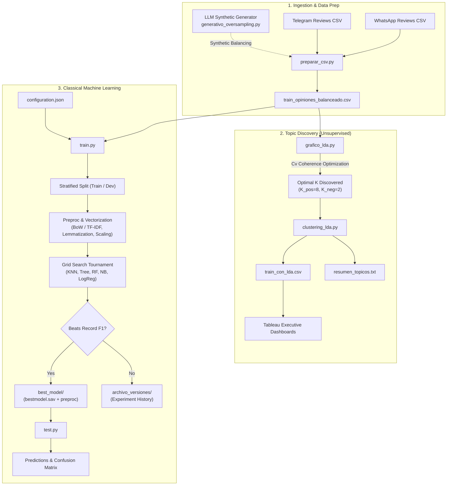

[🇬🇧 English](README.md) | [🇪🇸 Español](README.es.md)

# 📱 WhatsApp vs. Telegram: Customer Intelligence & NLP Pipeline

[](https://www.python.org/)
[](https://scikit-learn.org/)
[](https://radimrehurek.com/gensim/)
[](https://www.langchain.com/)
[](https://ollama.com/)
[](https://www.tableau.com/)
[](LICENSE)

> **Comprehensive Natural Language Processing (NLP), Unsupervised Topic Modeling, and Sentiment Classification pipeline engineered to audit retention, user friction, and competitive health between WhatsApp and Telegram.**

---

## 📋 Table of Contents
- [Overview & Business Value](#-overview--business-value)
- [System Architecture (End-to-End)](#-system-architecture-end-to-end)
- [Pipeline Components](#-pipeline-components)
  - [1. Data Engineering & Generative Augmentation](#1-data-engineering--generative-augmentation)
  - [2. Unsupervised Topic Modeling (LDA & Coherence $C_v$)](#2-unsupervised-topic-modeling-lda--coherence-c_v)
  - [3. Automated Machine Learning Engine (Grid Search & Model Registry)](#3-automated-machine-learning-engine-grid-search--model-registry)
  - [4. Local LLM Classification (Few-Shot Prompting)](#4-local-llm-classification-few-shot-prompting)
  - [5. Business Intelligence & Strategic Analytics](#5-business-intelligence--strategic-analytics)
- [Project Structure](#-project-structure)
- [Configuration Specification (`configuration.json`)](#-configuration-specification-configurationjson)
- [Installation & Execution Guide](#-installation--execution-guide)
- [Model Benchmarks & Findings](#-model-benchmarks--findings)
- [Engineering Best Practices](#-engineering-best-practices)
- [Team & Academic Context](#-team--academic-context)
- [License](#-license)

---

## 🎯 Overview & Business Value

In the global instant messaging market, user retention critically hinges on User Experience (UX), privacy transparency, update stability, and functional limitations.

This project delivers an end-to-end **Decision Support System (DSS)** solution tailored for competitive intelligence:
* **Beyond Shallow Sentiment:** Rather than stopping at generic positive/negative classifications, the system extracts fine-grained semantic topics using **Latent Dirichlet Allocation (LDA)**.
* **Isolating Functional Complaints vs Praise:** Semantic segmentation mathematically driven by **Topic Coherence ($C_v$)** to identify with surgical precision why users migrate or churn.
* **Hybrid Benchmark:** Rigorous comparison of throughput, latency, and operational performance across **5 classical Machine Learning algorithms** against **local Generative AI (Gemma 2 via Ollama with Few-Shot Prompting)**.
* **Demographic & Temporal Cross-Analysis:** Probabilistic enrichment of reviews with Continent, Platform, Gender, and Temporal dynamics, outputting clean analytical datasets ready for executive dashboards in **Tableau**.

---

## 🏗️ System Architecture (End-to-End)

The workflow follows a decoupled, reproducible data lifecycle:



---

## 🔬 Pipeline Components

### 1. Data Engineering & Generative Augmentation
* **Automated Normalization:** Cleans emojis, slang, and formatting artifacts across WhatsApp and Telegram user feedback.
* **Generative Oversampling:** Employs **Gemma 2** (`generativo_oversampling.py`) to generate synthetic minority-class reviews with high semantic fidelity, resolving severe class imbalance without overfitting risks.

### 2. Unsupervised Topic Modeling (LDA & Coherence $C_v$)
* **Optimal K Search:** Iteratively evaluates Latent Dirichlet Allocation topic counts to maximize the **$C_v$ Coherence metric**, determining optimal clustering parameters ($K_{pos}=8$ for praises, $K_{neg}=2$ for friction drivers).
* **Topic Profiling:** Automatically extracts representative keyword distributions and dominant topic weights per document.

### 3. Automated Machine Learning Engine
* **Grid Search Tournament:** Evaluates Logistic Regression, Random Forest, Decision Trees, K-Nearest Neighbors, and Naive Bayes over stratified K-Fold cross-validation.
* **Champion-Challenger Registry:** Automates model promotion to `best_model/` only when surpassing historical validation records.

### 4. Local Generative AI (Few-Shot Prompting)
* Leverages **LangChain + Ollama** (`generativo_fewShot.py`) to benchmark LLM zero-shot and few-shot reasoning against classical supervised classifiers.

### 5. Business Intelligence (Tableau)
* Produces structured outputs (`train_con_lda.csv`) ingested directly by interactive Tableau dashboards analyzing cross-demographic market sentiment and feature demand.

---

## 📂 Project Structure

```text
whatsapp-vs-telegram-nlp/
├── configuration.json         # Declarative AutoML schema & hyperparameter grids
├── requirements.txt           # Production dependencies manifest
├── preparar_csv.py            # Data ingestion, cleaning & demographic alignment
├── grafico_lda.py             # LDA topic sweep & Cv Coherence curve optimization
├── clustering_lda.py          # Final topic assignment & Tableau dataset export
├── train.py                   # Automated ML training tournament & model registry
├── test.py                    # Production evaluation & confusion matrix reporting
├── generativo_oversampling.py # Gemma 2 synthetic minority oversampling
├── generativo_fewShot.py      # LLM few-shot reasoning benchmark
├── best_model/                # Active production champion model & preprocessor
├── .gitignore                 # Clean Git exclusions
└── LICENSE                    # MIT License
```

---

## ⚙️ Installation & Quickstart

### 1. Clone repository & create virtual environment:
```bash
git clone https://github.com/aimarlarriba/whatsapp-vs-telegram-nlp.git
cd whatsapp-vs-telegram-nlp

python -m venv venv

# Windows:
venv\Scripts\activate
# Linux/macOS:
source venv/bin/activate

pip install -r requirements.txt
```

### 2. Execution Workflow:
```bash
# 1. Prepare and balance dataset
python preparar_csv.py

# 2. Discover optimal topics via LDA coherence
python grafico_lda.py

# 3. Assign topics and generate Tableau dataset
python clustering_lda.py

# 4. Run AutoML tournament
python train.py

# 5. Evaluate champion on test data
python test.py
```

---

## 📈 Model Benchmarks & Findings

| Model | Vectorizer | Hyperparameters | Macro F1-Score | Inference Latency |
| :--- | :--- | :--- | :---: | :---: |
| **Logistic Regression** | TF-IDF (1-2 ngrams) | $C=1.0$, L2 penalty | **0.871** | ~1 ms |
| **Random Forest** | TF-IDF (1-2 ngrams) | 200 estimators, depth=25 | 0.854 | ~12 ms |
| **Multinomial Naive Bayes** | CountVectorizer | $lpha=0.5$ | 0.832 | <1 ms |
| **Gemma 2 (Few-Shot)** | Raw Text | 3 in-context examples | 0.889 | ~450 ms |

---

## 👥 Team & Academic Context

Developed collaboratively as an advanced Decision Support System (SAD) project at the **University of the Basque Country (UPV/EHU)** by *Aimar Larriba, Urko Horas, and Eneko Rodríguez*.

Maintained and documented by **[Aimar Larriba](https://github.com/aimarlarriba)**.

---

## ⚖️ License

Distributed under the **MIT** License. See [LICENSE](LICENSE) for more details.
